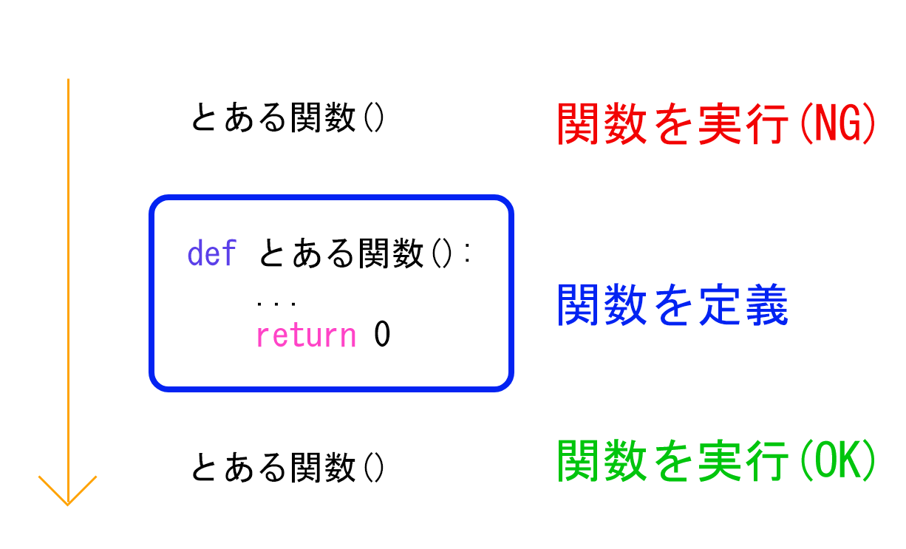
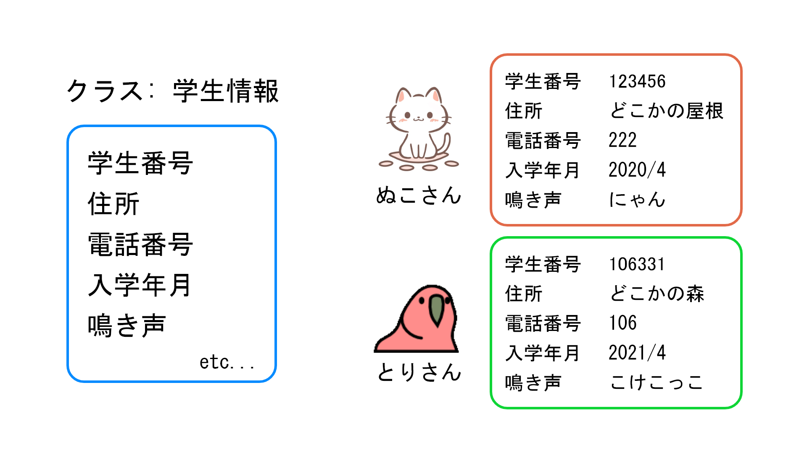

# python入門

## 始める前に...
以下で説明すること全て覚える必要はありません！(**全て調べることで出てくる**)<br>
「こんなものがある」「こんなことができる」ということが分かれば大丈夫です！<br>

## 目次
・[関数 (P.69-75)](./README.md#関数-p69-75)<br>
・[クラス (P.117-123)](./README.md#クラス-p117-123)<br>
・[リスト (P.125-135)](./README.md#リスト-p125-135)<br>
・[ファイル入出力 (P.137-148)](./README.md#ファイル入出力-p137-148)

## 参考資料
[京都大学 - プログラミング演習 Python 2019](https://repository.kulib.kyoto-u.ac.jp/dspace/bitstream/2433/245698/1/Version2020_02_13_01.pdf)


<br><br>


## 関数 (P.69-75)


### 関数の定義について

C言語では
``` c
// 返り値：なし
void f(){
}

// 返り値：double型
double f(){
    return <double>;
}

// 引数があるとき
void f(int a, double b){
}
```
といった形で関数を宣言していました。

Pythonでは
``` python
# 返り値なし
def f():
    ...

# 返り値あり：何でもOK(int, float, string, listなど)
def f():
    return <何か>

# 引数があるとき
def f(a, b):
    ...
```
のようになります。<br>
関数、引数ともに型の定義を行う必要がありません。<br>

### 3分で完成！足し算の関数を作ろう(演習)

引数が2つの関数を作って触ってみよう！

``` python
# 例
def 足し算を行う関数(a, b):
    result = a + b
    return result
```

<br>
関数が出来たら一度実行してみましょう！<br>
ここで1点注意があります。



関数の実行については、**定義をした後の部分**に行いましょう。

以下が実行結果の例です。
``` python
print(plus(1, 2)) # 出力: 3
print(plus(5.3, -0.2)) # 出力: 5.1
print(plus(3, 5.5)) # 出力: 8.5
```
<br>

### グローバル変数と関数
C言語では
``` c
int a = 0 // グローバル変数
void f(){
    a = 10;
    ...
}
```
のようにして関数内でもグローバル変数をそのまま使えますが、pythonでは
``` python
a   # グローバル変数
def f():
    global a    # 関数内でグローバル変数を使うという宣言
    a = 10
    ...
```
のように、関数内でglobalを使用して宣言を行わないといけません。

<br><br>

### グローバル変数に結果を残そう！(演習)
以下の条件でグローバル変数を使ってみよう！
・グローバル変数を0で初期化
・引数を1つ持った関数を宣言
・作成した関数内でグローバル変数と引数を足す処理を行う

予想される結果
``` python
a = 0       # グローバル変数
...
f(5)
print(a)    # 出力：5
f(-0.5)
print(a)    # 出力：4.5
```

<br><br>

### デフォルト引数
``` python
def f(a, b= 5):
    print("a = " + a + " b = " + b)

f(10, 3)    # 出力： a = 10 b = 3
f(1)        # 出力： a = 1  b = 5 (f(1, 5)と同義)
```

<br><br>

## クラス (P.117-123)

### そもそもクラスって何？
・「クラス」は独自の状態やメソッドを持つオブジェクトを生成するための「型」<br>
・クラスから生成された個々のオブジェクトを「インスタンス」と呼びます

<br>

### 【具体例】

・「学生情報」というクラスと「ぬこさん」「とりさん」というインスタンス変数がある<br>
・「ぬこさん」「とりさん」に「学生情報」という型を使って情報を付与する行為 → ***インスタンス化***

<br>

### P.118 実行例(電卓プログラム - class.py)
    教える前に...

    ・資料内6行目「self_operation = '+'」→ 「self.operation = '+'」だと思う

    ・メソッドの説明が思いつかなかった...
    　クラス内に宣言する関数的な立ち位置(でいいのか...？)

### ざっくり解説！
    ・ 1行目  class Dentaku()
    Dentakuっていうクラス(型)を宣言

    ・ 2行目  def __init__(self, data)
    インスタンス化する時に発火するメソッド
    selfは今回でいうDentaku自身を指している(絶対に必要、分かりにくいね...)

    ・3-6行目 self.[変数名]
    色々な変数を作って初期化してるよ！(上記画像でいう「学生番号」「住所」といったもの)

    ・ 8行目  def do_operation(self)
    クラス(型)内に新しくメソッドを定義
    自分で作成したメソッドは好きな時に発火できるよ！
    selfはとりあえず必要なので書いておこう！

    ・15行目  dentaku = Dentaku()
    これがインスタンス化！(上記画像でいうぬこに情報を付与する段階)
    dentakuという変数にクラス(型)Dentakuをあてはめてる感じ

    ・17-24行目 dentaku.[色々]
    クラス(型)で宣言した変数やメソッドを呼び出してる！


詳しい説明については「class_sample.py」のコメントを見てください！

<br>

### コードを書いてみよう！(演習)
1. [【具体例】](./README.md#【具体例】)を元に「学生情報」クラスを作ってみましょう！

#### 【クラスを作成する時の条件】
    ・クラスやクラス内変数の命名は各自考えてつける
    ・クラス内変数の型は以下の通りであるとして進める

|  名称  |  型  |
|:------:|:----:|
|学生番号|整数型(integer)|
|住所　　|文字型(String)|
|電話番号|整数型(integer)|
|入学年月|文字型(String)|
|鳴き声　|文字型(String)|

<br>

2. インスタンス化をしてみよう！
「ぬこさん」「とりさん」に先ほど作ったクラスを使って情報を与えよう！
``` python
ぬこさん = 学生情報()
とりさん = 学生情報()
```

3. インスタンス変数に情報を追加しよう！
``` python
ぬこさん.学生番号 = 123456
ぬこさん.住所 = 'どこかの屋根'
...
とりさん.鳴き声 = 'こけこっこ'
```

4. 登録した情報を表示してみよう！
``` python
print('表示を行う時は、関数print()を使おう！')
# 表示例
print(ぬこさん.学生番号) # 出力: 123456
print(とりさん.学生番号) # 出力: 106331
```

<br>

### さらにクラスをより良いものに(演習)
1. インスタンス化した後に情報を一つずつ入れている<br>
→　インスタンス化すると同時に情報を入れよう！<br><br>
    
    ・学生情報クラスの__init__に引数を追加する<br>

    ``` python
    def __init__(self, num, adr, p_num, adm, cry):  # 必要な要素(num, adr, p_num, adm, cry)を追加
        self.学生番号 = num     # それぞれクラス内変数に格納
        self.住所 = adr
        ...
    ```
<br>
    ・インスタンス化を行う部分で引数に情報を追加<br>

    ``` python
    ぬこさん = 学生情報(123456, 'どこかの屋根', 222, '2020/4', 'にゃん') # 引数に情報を入れる
    ...
    ```
<br>
    ・データを一つずつ入れる部分は消して大丈夫です！

    ``` python
    # 該当箇所(消してよい)
    ぬこさん.学生番号 = 123456
    ぬこさん.住所 = 'どこかの屋根'
    ...
    とりさん.鳴き声 = 'こけこっこ'
    ```
<br>
    これでデータを同じように持ってこようとすると表示されるはず！<br>

    ``` python
    # 表示例
    print(ぬこさん.学生番号) # 出力: 123456
    ```

<br><br>

2. クラス内変数のデータを変更する時に、入力されたデータが正しいか確認する<br>
(今回は電話番号を変更する際に、入力されたデータ型があっているかを確認します)

    今までの変更方法

    ``` python
    ぬこさん.電話番号 = 'これは文字列'
    ```

    これだと文字列も入ってしまうので、入力されたデータが整数型になっているかを確認してから代入します

    <br>

    ・クラスに電話番号を変更するための「メソッド」を追加する

    メソッドって関数的なもの（説明が難しい...）<br>
    とりあえず追加してみよう！

    学生情報クラスに以下のようなメソッドを追加する

    ``` python
    def ChangePhoneNumber(self, phone_number):
        # 入力が整数型かどうか
        if type(phone_number) == type(int()):
            # 変更を行う
            self.phone_number = phone_number
            print('電話番号を変更しました')
        else:
            print('電話番号を変更しませんでした')
    ```

<br>

    ・作成したメソッドを使ってみよう！

    ``` python
    ぬこさん.ChangePhoneNumber(999)
    print(cat.phone_number) # 出力: 999
    ぬこさん.ChangePhoneNumber('これは文字列')
    print(cat.phone_number) # 出力: 999
    ```

<br>  

### クラスを使うことのメリット
    ・データ構造がはっきりする
    →例では「学生番号」「住所」などあるべき情報を定義いておくことで、ややこしくならない
    ・同じ事を何回でも繰り返さなくて済む
    →「ぬこさん」「とりさん」以外にも沢山の人が存在する場合に、1人ごとに最初から定義をしなくてよい

    最初は使い道に困るが、慣れると便利！


<br><br>

## リスト (P.125-135)

### リストの概要
C言語では「配列」との表記でありました。
配列の宣言は
``` c
int a[3] = {3, 5, 1};
printf("%d", a[0]) // 出力：3
a[1] = 0
printf("%d", a[1]) // 出力：0
```
のように使用していました。

Pythonでは
``` python
a = [3, 5, 1]
print(a[0]) # 出力：3
a[1] = 0
print(a[1]) # 出力：0
```
のように記述します。(前回習ったように変数定義はありません)

<br><br>

### リストの色々な使い方
1. 要素を指定した生成
    ``` python
    # [,]で区切る
    a = [5, 1, 3, 4]

    # 文字列もいけるんご！
    b = ['ねこ', 'いぬ', 'とり', 'かわうそ']

    # 色々な型を並べられるよ！
    c = [2, 10.5, '明日晴れるよ']
    ```

<br>

2. range() との組みあわせ
    ``` python
    # この変数がリストであることを宣言することもできます！
    e = list()

    # range関数を使うと順番にリストの要素を入れてくれます！
    m = list(range(5)) # [0, 1, 2, 3, 4]
    l = list(range(3)) # [0, 1, 2]
    ```

<br>

3. 文字列からの生成
    ``` python
    # 1文字ずつ分けてくれる！
    s = list('abcde') # ['a', 'b', 'c', 'd', 'e']

    # 単語毎にだって分けられるよ！Pythonくん凄いね！
    t = 'a textbook of Python'
    # splitメソッドを使うことでスペースがあると自動的に区切ってくれます！
    tlist = t.split() # ['a', 'textbook', 'of', 'Python']
    ```

<br>

4. 要素数を取得する
    ``` python
    # len関数で要素数が分かります！
    a = [5, 1, 3, 4]
    print( len(a) ) # 出力：4
    ```

<br>

5. for文とのコンビネーション
    ``` python
    a = [5, 1, 3, 4]
    # 今回は 0～3 まで回す ( len(a)が4 )
    for i in range(len(a)):
        print(i, a[i])

    # 出力
    # 0 5
    # 1 1
    # 2 3
    # 3 4

    # リストの中身を1つずつiに代入してる
    for i in a:
        print(i)

    # 出力
    # 5
    # 1
    # 3
    # 4
    ```

<br>

6. 負の添え字
    ``` python
    a = [5, 1, 3, 4]
    # 添え字に -[数字] を入れると 後ろから数えて[数字]の部分の要素を取り出す
    print(a[-1])     # 出力： 4 (後ろから数えて1番目)
    print(a[-2])     # 出力： 3 (後ろから数えて2番目)
    print(a[-3])     # 出力： 1 (後ろから数えて3番目)
    print(a[-4])     # 出力： 5 (後ろから数えて4番目)
    ```

<br>

7. スライス(一部分の範囲を取り出す)
    ``` python
    a = [5, 1, 3, 4]
    # 要素に[a:b]と書くと、a~(b-1) 番目の要素を切り取る
    b = a[1:3]   # [1, 3]
    c = a[0:2]   # [5, 1]
    ```

<br>

8. リストの追加、結合
    ```　python
    a = [5, 1, 3, 4]
    # appendメソッド
    a.append(2)         # [5, 1, 3, 4, 2]
    a.append([9, 4])    # [5, 1, 3, 4, 2, [9, 4]]

    b = [5, 1, 3, 4]
    # extendメソッド
    b.extend([2, 6])    # [5, 1, 3, 4, 2, 6]
    b.extend(10)        # エラーが出ます！(TypeError)
    ```

<br>

9. 2次元配列
    ``` python
    a = [[1, 2, 3], [4, 5, 6], [7, 8, 9]]
    print(a[0][1])  # 出力： 2
    print(a[1][2])  # 出力： 6
    print(a[2][0])  # 出力： 7
    ```

<br>

10. 内包表記
    ``` python
    a = []
    for i in range(5):
        a.append(i*i)
    print(a)    # [0, 1, 4, 9, 16]

    # 内包表記
    b = []
    b = [i*i for i in range(5)]
    print(b)    # [0, 1, 4, 9, 16]
    ```

<br>

11. コピー
    #### リストを他の変数にコピーする
    ``` python
    a = [1, 2, 3]
    b = a
    print(a)    # [1, 2, 3]
    print(b)    # [1, 2, 3]
    ```

    #### a = [1, 0, 3] b = [0, 2, 3] にしたい(誤り)
    ``` python
    a[1] = 0
    b[0] = 0
    print(a)    # [0, 0, 3]
    print(b)    # [0, 0, 3]
    ```

    #### a = [1, 0, 3] b = [0, 2, 3] にしたい(正解)
    ``` python
    b = a.copy()
    a[1] = 0
    b[0] = 0
    print(a)    # [1, 0, 3]
    print(b)    # [0, 2, 3]
    ```

    #### 2次元配列でもひっかけが...
    これは大丈夫
    ``` python
    a = [[1, 2], [3, 4]]
    b = a.copy()
    b.append([5, 6])
    print(a)    # [[1, 2], [3, 4]]
    print(b)    # [[1, 2], [3, 4],[5, 6]]
    ```   

    <br>

    でもこれはNG
    ``` python
    a = [[1, 2], [3, 4]]
    b = a.copy()
    b[0][0] = 0
    print(a)    # [[0, 2], [3, 4]]
    print(b)    # [[0, 2], [3, 4]]
    ```

    <br>

    原因は
    ``` python
    print(id(a[0])) # 出力： 3188920520008
    print(id(b[0])) # 出力： 3188920520008
    ```
    中にあるリストが**参照渡し**になっているため(IDが同じ)<br>
    リストを扱うときには気を付けて扱いましょう！


<br><br>

## ファイル入出力 (P.137-148)

### CSVファイルについて(P139)
テキストファイルの一形式で各行が
```
データ 1, データ 2, データ 3
```
などのようにデータとデータの間をカンマ「,」で区切った形式である。<br>
またExcel などの表計算ソフトで読み込むことができ、グラフ作成などが簡単に行える。
<br><br>
詳しくは資料(P139)を見るかググってくれ。


<br>


### とりあえず動かせって資料にかいてありました！(演習)

#### 書き込み、読み込み 
``` python
# 書き込み
# 日本語ファイル.txt という名称のファイルを作成し、内容を書き出します
f = open('日本語ファイル.txt','w')
f.write('日本語\n 日本語\n 日本語\n')
f.close()

# (一気に)読み込み
# 日本語ファイル.txt を読み込み用に open して、その内容を表示します
f = open('日本語ファイル.txt','r')
s = f.read()    # テキストファイルから全体を文字列として読んで変数 s に代入
f.close()
print(s)

# (一行ずつ)読み込み
file = open("ファイル名", "r")
for line in file:
    # 一行ずつ処理するブロック
    print(line)
file.close()
```
ファイルポインタはopen()したらclose()をすることを忘れずに

<br>

#### with 文の利用 ― close()の自動化
``` python
with open("ファイル名", "r") as f:
    # ファイルを操作するブロック
    s = f.read()

# 自動的にclose()される
print(s)
```

<br><br>

### 資料はここまで～
資料を元にざっくりまとめました。<br>
分からないことがあれば遠慮なく聞いてください！<br>
もちろん自分も分からない場合があるので、その時は一緒に考えるなり頑張って調べてみるなりしてみましょう！
